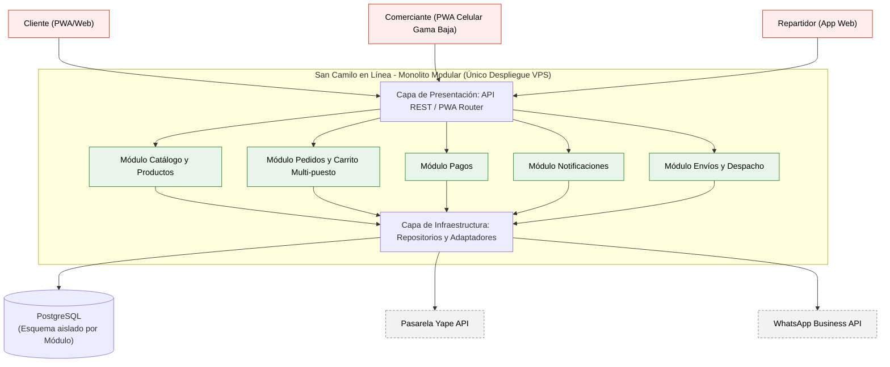

# San Camilo en Línea - Laboratorio 04: Fundamentos de Arquitectura de Software

**Curso:** Construcción de Software (EPIS-UNSA)  
**Semestre:** 2026-B  
**Grupo:** Grupo 07  

## Integrantes
* **Jhon Deyvis Cuyo Ccapa:** Creador principal de diagramas como código (Mermaid, PlantUML, Python) y redactor de ADRs.
* **Wilber Jesus Guerra Pilco:** Verificador de propuestas de IA, encargado de la bitácora de IA y revisor de Pull Requests.
* **Diego Sebastian Santacruz Villa:** Encargado de la estructura del proyecto, documentación de drivers y redactor de la reflexión grupal.

## Caso 7: San Camilo en Línea
Plataforma web y móvil diseñada para canalizar los pedidos a los puestos del Mercado San Camilo de Arequipa, permitiendo opciones de recojo o delivery. Los clientes pueden explorar catálogos agrupados por puesto, realizar pedidos multi-puesto y pagar mediante Yape. Las confirmaciones de compra se notifican automáticamente al comerciante vía WhatsApp API.

* **Atributo de Calidad Crítico:** Usabilidad / Capacidad de interacción (QA-01). Un comerciante con poca experiencia digital debe poder publicar un producto en su catálogo en $\le 3$ toques desde un smartphone de gama baja en red 3G.

## Arquitectura Elegida (Monolito Modular)

## Registros de Decisiones Arquitectónicas (ADRs)
* [ADR-001: Estilo Arquitectónico - Monolito Modular](docs/architecture/adr/001-estilo-arquitectonico.md)
* [ADR-002: Selección de Base de Datos - PostgreSQL con Esquemas Aislados](docs/architecture/adr/002-base-de-datos.md)
* [ADR-003: Estrategia de Cliente Móvil - Progressive Web App (PWA)](docs/architecture/adr/003-pwa-vs-nativa.md)

## Documentación Adicional
* [Drivers Arquitectónicos y Escenarios de Calidad](docs/architecture/drivers.md)
* [Matriz de Decisión Ponderada](docs/architecture/matriz-decision.md)
* [Bitácora de Uso de Inteligencia Artificial](docs/architecture/bitacora-ia.md)

## Reflexión sobre el Uso de la IA
El uso de asistentes de IA facilitó la exploración inicial de patrones y la aceleración en la sintaxis de diagramas como código (Mermaid y PlantUML). Sin embargo, identificamos que la IA tiende a sesgarse hacia arquitecturas complejas de moda (como Microservicios y Kubernetes), las cuales sobrepasan nuestras restricciones de 1 mes de plazo, equipo de 3 integrantes y despliegue en un único VPS económico. Aprendimos que la IA debe utilizarse únicamente como herramienta de soporte para acelerar la redacción y generación de borradores, mientras que el análisis crítico, la verificación de factibilidad real y la toma final de decisiones son responsabilidad absoluta del equipo humano.